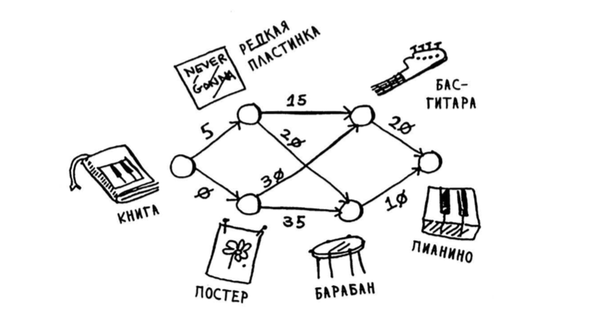

[Оглавление](../../../../#readme) > [Глава 7. Знакомство с алгоритмами](../#readme) > Пример поиска кратчайшего пути по алгоритму Дейкстры

# Пример поиска кратчайшего пути по алгоритму Дейкстры

Рама хочет выменять свою книгу по музыке на пианино. Через цепочку обменов он может это сделать.

На этом графе представлены возможные обмены предметов. Каждое ребро имеет вес - сумму доплаты. Нужно самую дешевую цепочку от книги до пианино.

На данный момент мы находимся в узле Книга и имеем следующую картину:

Проверен|Узел|Вес|Родитель
-|-|-|-
-|Пластинка|5|Книга
-|Постер|0|Книга
-|Барабан|бесконечность|-
-|Гитара|бесконечность|-
-|Пианино|бесконечность|-

## Шаг 1.1. Выбираем узел с наименьшей стоимостью

Это постер (стоимость = 0). Дешевле добраться до этого узла никак нельзя.

## Шаг 1.2. Обновляем стоимости соседних узлов

Перемещаемся в этот узел и обновляем стоимости для соседних с ним узлов (если они меньше, чем исходные).

Проверен|Узел|Вес|Родитель
-|-|-|-
-|Пластинка|5|Книга
+|Постер|0|Книга
-|Барабан|35|Постер
-|Гитара|30|Постер
-|Пианино|бесконечность|-

Обновились стоимости для Гитары и Барабана.

## Шаг 2.1. Выбираем узел с наименьшей стоимостью (из непроверенных)

Самый дешевый узел из непроверенных - пластинка (стоимость = 5).

## Шаг 2.2. Обновляем стоимости соседних узлов

Из Пластинки можно переместиться к Гитаре и Барабану. Рассчитываем их стоимость как 5 плюс вес соответствующего ребра.

Проверен|Узел|Вес|Родитель
-|-|-|-
+|Пластинка|5|Книга
+|Постер|0|Книга
-|Барабан|25|Пластинка
-|Гитара|20|Пластинка
-|Пианино|бесконечность|-

Обновились веса (и родитель) для узлов Гитара и Барабан. От Пластинки до них добраться дешевле, чем от Постера.

## Шаг 3.1. Выбираем узел с наименьшей стоимостью (из непроверенных)

Это Гитара (стоимость = 20)

## Шаг 3.2. Обновляем стоимости соседних узлов

Проверен|Узел|Вес|Родитель
-|-|-|-
+|Пластинка|5|Книга
+|Постер|0|Книга
-|Барабан|25|Пластинка
+|Гитара|20|Пластинка
-|Пианино|40|Гитара

Обновилась стоимость пути до Пианино.

## Шаг 4.1. Выбираем узел с наименьшей стоимостью (из непроверенных)

Остался только Барабан (стоимость = 25).

## Шаг 4.2. Обновляем стоимости соседних узлов

Проверен|Узел|Вес|Родитель
-|-|-|-
+|Пластинка|5|Книга
+|Постер|0|Книга
+|Барабан|25|Пластинка
+|Гитара|20|Пластинка
-|Пианино|35|Барабан

Снова обновился вес Пианино, от Барабана до него добраться дешевле, чем от Гитары.

## Поиск кратчайшего пути

Мы проверили все узлы и вычислили, что самая дешевая цепочка обмена будет стоить Раме 35 (долларов). Теперь нужно определить, какому именно пути соответствует эта цепочка.

Пианино -> Барабан -> Пластинка -> Книга.