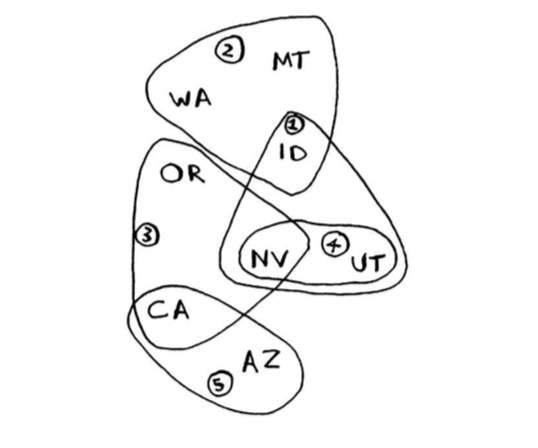

# Глава 8. Жадные алгоритмы

## Задача составления расписания

Есть расписание уроков, которые идут в определенное время. Некоторые уроки перекрывают друг друга.

Урок|Начало|Конец
-|-|-
Рисование|9:00|10:00
Английский|9:30|10:30
Математика|10:00|11:00
Информатика|10:30|11:30
Музыка|11:00|12:00

Нужно провести в классе как можно больше уроков.

Жадный алгоритм для решения этой задачи очень прост:

1. Выбрать урок, завершающийся раньше всех. Это первый урок, который будет проведен в классе.
2. Затем выбирается урок, начинающийся после завершения первого уро­ ка. И снова следует выбрать урок, который завершается раньше всех остальных. Он становится вторым уроком в расписании.

Результат:

Урок|Начало|Конец
-|-|-
Рисование|9:00|10:00
Математика|10:00|11:00
Музыка|11:00|12:00

```
npm run greedy-shedule
```

> на каждом шаге выбирается *локально-оптимальное* решение,
> а в итоге вы получаете *глобально-оптимальное* решение.

## Задача о рюкзаке

> Представьте, что вы жадный воришка. Вы забрались в магазин с рюкзаком, и перед вами множество товаров, которые вы можете украсть. Однако емкость рюкзака не бесконечна: он выдержит не более 35 фунтов.
>
> Требуется подобрать набор то­варов максимальной стоимости, которые можно сложить в рюкзак.

Жадная стратегия:

1. Выбрать самый дорогой предмет, который поместится в рюкзаке.
2. Выбрать следующий по стоимости предмет, который поместится в рюк­заке... И так далее.

Но тут эта стратегия не работает (вернее, работает не идеально).


> В некоторых случаях достаточно алгоритма, способного решить задачу достаточно хорошо. И в таких областях жадные алгоритмы работают просто отлично, потому что они просто реализуются, а получен­ ное решение обычно близко к оптимуму.

## Задача о покрытии множества

> Вы открываете собственную авторскую програм­му на радио и хотите, чтобы вас слушали во всех 50 штатах. Нужно решить, на каких радиостанци­ях должна транслироваться ваша передача. Каждая станция стоит денег, поэтому количество станций не­ обходимо свести к минимуму.
>
> Имеется список станций. Каждая станция покрывает определенный набор штатов, эти наборы пере­крываются.
>
> 
>
> Как найти минимальный набор станций, который бы покрывал все 50 шта­тов?

Это чрезвычайно сложная задача.

1. Составить список всех возможных подмножеств станций - так на­ зываемое степенное множество. В нем содержатся 2<sup>n</sup> возможных подмножеств. Это все возможные комбинации станций (по две, по три, по четыре, и т.д.)
2. Из этого списка выбирается множество с наименьшим набором станций, покрывающих все 50 штатов.

Выполнение первого пункта занимает слишком много времени.

Кол-во станций|Необходимое время
-|-
5|3.2 сек
10|102.4 сек
32|13.6 года

Поэтому для ее решения лучше использовать жадный алгоритм!

## Приближенные алгоритмы

1. Выбрать станцию, покрывающую наибольшее количество штатов, еще не входящих в покрытие. Если станция будет покрывать некоторые штаты, уже входящие в покрытие, это нормально.
2. Повторять, пока остаются штаты, не входящие в покрытие.

Время выполнения этого алгоритма - O(n<sup>2</sup>), где n - количество радиостанций.

```
npm run greedy-set
```

## NP-полные задачи

### Задача о коммивояжере

**Условие**: коммивояжер хочет объехать 5 городов - и сделать это за минимально возможное время.

**Решение**: перебрать все возможные комбинации порядка объезда городов. (для 5 элементов - 120 перестановок - `n!`).

Если городов много, то решение будет занимать слишком много времени, как и в задаче покрытия множества.

> У задачи о коммивояжере и задаче покрытия множества есть кое-что общее: вы вычисляете каждое возможное решение и выбираете кратчайшее/мини­ мальное. Обе эти задачи являются **NР-полными**.

Жадное решение для задачи о коммивояжере: выбирать каждый раз самый ближний город из еще непосещенных.

### Как определить, что задача является NР-полной?

Обычно различия между легко решаемыми и NP-полными задачами не очень значительны.

Например, задача поиска кратчайшего пути между точками легко решается поиском в ширину (или алгоритмом Дейкстры для взвешенных графов). Но если нужно найти кратчайший путь между несколькими точками - это уже NP-полная задача о коммивояжере.

Несколько характерных признаков:

* ваш алгоритм быстро работает при малом количестве элементов, но сильно замедляется при увеличении их числа;
* формулировка *все комбинации х* часто указывает на NР-полноту за­ дачи;
* вам приходится вычислять все возможные варианты Х, потому что за­ дачу невозможно разбить на меньшие подзадачи? Такая задача может оказаться NР-полной;
* если в задаче встречается некоторая последовательность (например, последовательность городов, как в задаче о коммивояжере) и задача не имеет простого решения, она может оказаться NР-полной;
* если в задаче встречается некоторое множество (например, множество радиостанций) и задача не имеет простого решения, она может оказаться NР-полной;
* можно ли переформулировать задачу в условиях задачи покрытия множества или задачи о коммивояжере? В таком случае ваша задача определенно является NР-полной.