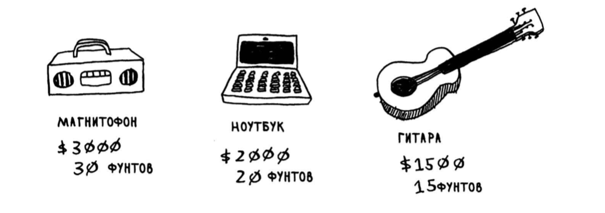

# Задача о рюкзаке (жадные алгоритмы)

## Условие

Представьте, что вы жадный воришка. Вы забрались в магазин с рюкзаком, и перед вами множество товаров, которые вы можете украсть. Однако емкость рюкзака не бесконечна: он выдержит не более 35 фунтов.

Требуется подобрать набор то­варов максимальной стоимости, которые можно сложить в рюкзак.

## Жадная стратегия

1. Выбрать самый дорогой предмет, который поместится в рюкзаке.
2. Выбрать следующий по стоимости предмет, который поместится в рюк­заке... И так далее.

Но тут эта стратегия не работает (вернее, работает не идеально).

## Приближенное значение

В некоторых случаях достаточно алгоритма, способного решить задачу достаточно хорошо. И в таких областях жадные алгоритмы работают просто отлично, потому что они просто реализуются, а получен­ ное решение обычно близко к оптимуму.